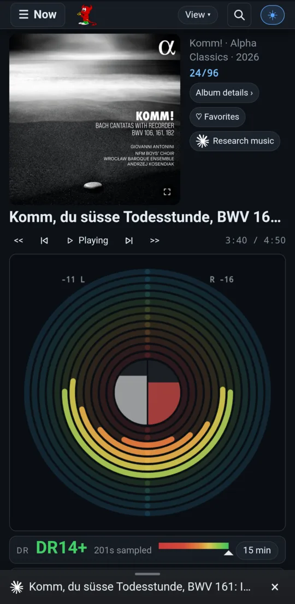
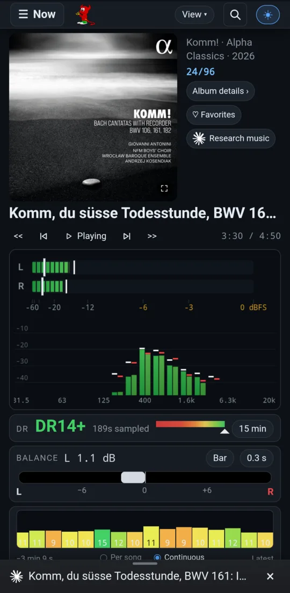
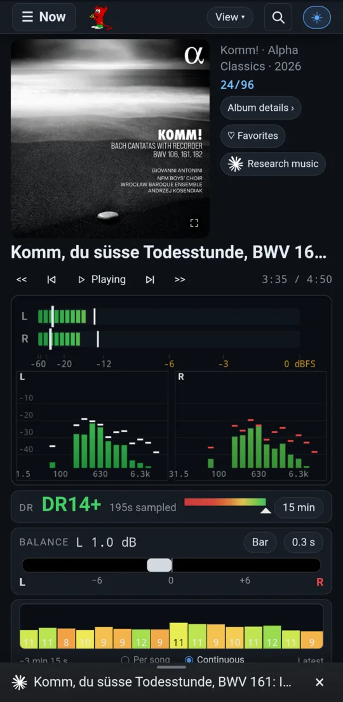
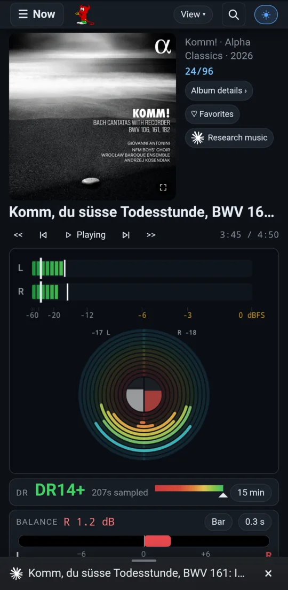
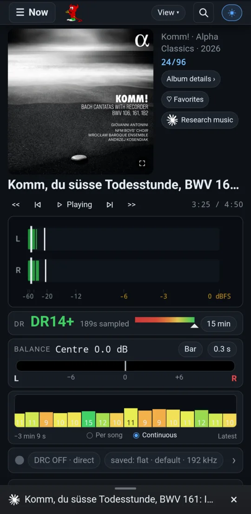
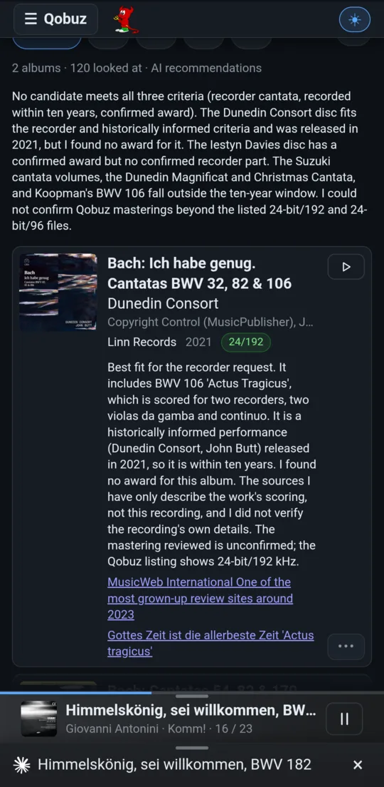
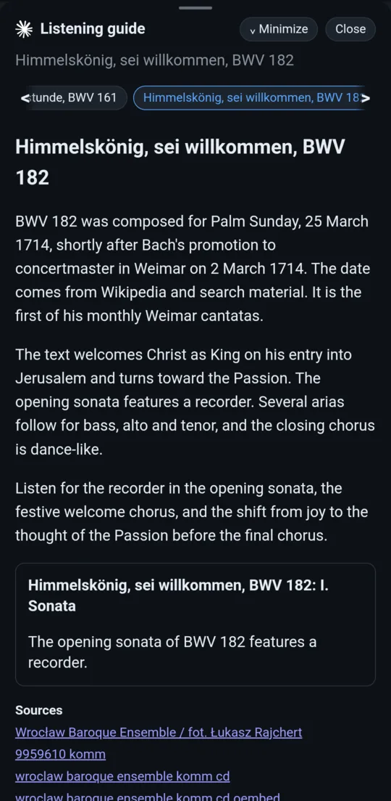
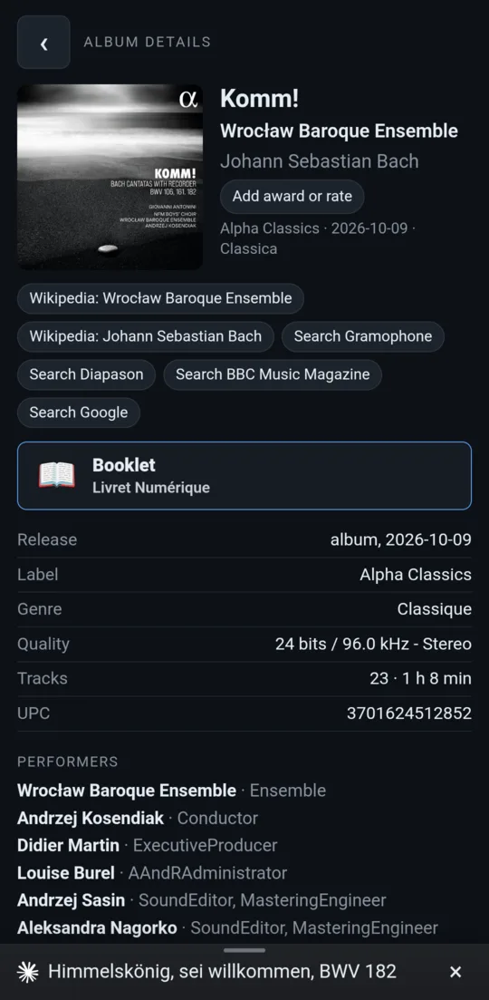

# open-media-drc

**A music appliance that corrects your room and measures your music.** It
also finds the recording you are looking for on Qobuz, which Qobuz's own
apps can't do.

open-media-drc turns a small headless computer (Linux or FreeBSD) and a USB
DAC into a hi-fi source. Streams, files and CDs pass through 64-bit FIR room
correction on their way to the DAC. With correction off, the box uses a direct
DAC path whose bit-perfection is checked with a USB tap. You control
everything from a phone, a 7" touch screen, a KDE panel or a browser.

<p align="center">
  
  
  
  
</p>

## What it does

**Room correction you can trust.**
[BruteFIR](https://github.com/delleceste/brutefir) convolves every channel with
float64 FIR filters designed in Room EQ Wizard. Each filter is published with
its origin, headroom and checksums, so you always know which design is in the
signal path. Switch it off and the chain falls back to the direct DAC path,
which the project's USB-tap tool checks for bit-perfection.
→ [Room correction and the audio chain](doc/guide/room-correction.md)

<p align="center"></p>

**Dynamic range, measured live and offline.** Tells you how compressed the
master you are hearing really is.

- A **live DR estimate** runs while the music plays, with a colour-coded history of the last minutes.
- The **DR log** keeps every track's DR across listening sessions and ranks your albums by it.
- An **offline DR14 scan** writes a `dr14.txt` for every album in your local collection.
- **Measure DR** measures the copy you are streaming with the reference algorithm.
- **Which master is playing?** compares it with the versions listed on dr.loudness-war.info.
- **Shared between boxes**: several boxes pool what they measure through a private git repository.

→ [Dynamic range](doc/guide/dynamic-range.md)

**Qobuz search with filters, which Qobuz doesn't have.** Search by **label**
(tick Pentatone, DG and BIS at once, every spelling matched) and by **release
date** (the last N years, or a range of years). You can also sort **newest
first**, show **awarded only**, **Hi-Res only**, or albums from **your local
collection**. Search-term completion knows about 2,600 composers, works and
performers. **Lower** an album, a whole label or an artist and it moves to the
end of every result list. Discover reads a label's **entire catalogue**, not
only this month's releases.
→ [Qobuz](doc/guide/qobuz.md)

**AI that has read the reviews.**

- **Ask AI** takes a plain-language request ("three Beethoven Fifths,
  prioritizing sound engineering"), searches the web for reviews, plans Qobuz
  searches, and returns playable albums, each with its reasons and the reviews
  behind it.
- The **listening guide** researches the album that is playing: the works, the
  composer's life at the time, the performers, and what to listen for in each
  track. While it is open it **follows playback**: a new album gets its own
  research automatically, and the guide moves to the work and track playing,
  until you close it.

→ [AI search and the listening guide](doc/guide/ai.md)

**Favourites in hierarchical folders, which Qobuz doesn't have.** Organize your
Qobuz library in nested folders shown as cover tiles (Classical → Gramophone →
Awards → 2024…). You can reorder them by dragging, and the order is shared by
every device. The folders are ordinary Qobuz playlists, so nothing is locked
in.
→ [Qobuz](doc/guide/qobuz.md#favourites-folders-qobuz-doesnt-have)

**Awards and your own ratings.** Awards that Qobuz lists are collected as you
meet them. Qobuz lists few of the magazines' choices, so you can add your own
(Gramophone, Diapason, BBC Music Magazine, Stereophile, Hi-Fi News…) and a 1–3
rating. The Awarded list holds them
all and is searchable.

**Six live level displays.** VU needles, LED bars, bars with a spectrum, a
separate left/right spectrum, a circular spectrum, or bars with a circular
spectrum. Each comes with live channel balance, peak and RMS readouts, and a
DR history bar. A double tap steps to the next display.
→ [Now playing](doc/guide/now-playing.md)

**And also:**

- **Album details**: the digital booklet, the performers and engineers, Wikipedia links, and one-tap review searches.
- **Your local collection** appears next to Qobuz in search results, with its DR.
- **CD input**: a CD transport's S/PDIF captured into the DRC chain.
- **Video and Blu-ray**: mpv playback with a phone web remote.
- **Bit-perfect verification**: the USB tap compares the bytes actually sent to the DAC.
- **Clients**: an Android app with home-screen widgets, a KDE Plasma widget and a desktop web panel.

→ [Clients](doc/guide/clients.md)

## Gallery

| | | | |
|---|---|---|---|
|  |  |  |  |
| Bars + spectrum | Separate L/R spectrum | Bars + circular spectrum | Bars |
|  |  |  |  |
| Filtered results, newest first | Discover, by genre | Inside a folder | Awarded |
|  |  |  |  |
| Ask AI: picks with reasons | Listening guide | Full-screen player | Album details |
|  |  |  |  |
| Live DR and DR log | Albums by DR | Room correction | Audio chain |

## Guides

| Guide | What it covers |
|---|---|
| [Now playing](doc/guide/now-playing.md) | The six level displays, peak and RMS, DR bar and history, channel balance, cover and seek ring |
| [Qobuz](doc/guide/qobuz.md) | Search and its filters, Results / History / Discover / Awarded / Favourites, lowering, the player |
| [AI](doc/guide/ai.md) | Ask AI and the listening guide, providers and costs |
| [Dynamic range](doc/guide/dynamic-range.md) | Live estimate, DR log, albums by DR, DR14 scan, measuring the stream, which master |
| [Room correction](doc/guide/room-correction.md) | The DRC page, filters and their provenance, the audio chain, sources, bit-perfect checks |
| [Clients](doc/guide/clients.md) | The kiosk, the Android app and its widgets, the KDE Plasma widget, the web panel, video |

The complete administrator and user guide is the
[manual](doc/open-media-drc-manual.pdf)
([Markdown source](doc/pdf/open-media-drc-manual.md)). It covers
hardware-specific setup, troubleshooting, verification and the filter-design
workflow.

## How it works

```
 Qobuz / UPnP / files ─→ upmpdcli ─┐         ┌─ DRC on:  loopback → BruteFIR (float64 FIR) ─┐
 Qobuz Connect ─→ qobuzconnect2mpd ┴─→ MPD ──┤                                              ├─→ USB DAC
                                             └─ DRC off: direct, bit-perfect ───────────────┘
 CD transport (S/PDIF) ─→ capture bridge ─→ loopback (DRC only, no resampling)

 omdrcctrl (port 9090): desktop panel, kiosk /k/, Android app, KDE Plasma widget
```

The audio chain rests in one of only two states: **DRC fully up**, or **direct
output**. `drc.sh` is the single control point. It reconciles your saved intent
with what the hardware actually shows: if the DAC disappears, the chain tears
down and comes back by itself; a failed start rolls back to direct output.
Linux (Arch is the reference) uses ALSA and `snd-aloop`. FreeBSD (15.1 is the
reference) uses OSS and `virtual_oss`.

## Quick install

This is an appliance-oriented project: configure it on the audio host and use
the supplied `host.cmake` to describe that host. The build installs to
`/usr/local` by default.

1. Install the prerequisites for your platform: a C/C++ compiler, CMake,
   Meson, Ninja, pkg-config, git, MPD, FFTW3 (single and double precision),
   and the Python dependencies for the controller (`flask`, `markdown`, and
   optionally `numpy`). Linux additionally needs ALSA and `snd-aloop`;
   FreeBSD needs `virtual_oss` and `cuse`. The exact package names are in the manual's
   [Linux](doc/pdf/open-media-drc-manual.md#linux-installation-and-lifecycle-seclinux-install) and
   [FreeBSD](doc/pdf/open-media-drc-manual.md#freebsd-installation-secfbsd-install) installation chapters.

2. Build the external playback components in signal order: `libnpupnp`,
   `libupnpp`, `upmpdcli`, then the
   [delleceste BruteFIR fork](https://github.com/delleceste/brutefir).
   MPD itself is normally installed from the operating-system package. The
   commands and required upmpdcli metadata patch are documented in the
   [manual](doc/pdf/open-media-drc-manual.md#installation-the-common-build-secinstall).

3. Clone and configure this repository. Start with a fresh build directory;
   `host.cmake` is an initial CMake cache, so it must be supplied on the first
   configure.

   ```sh
   git clone --recursive https://github.com/delleceste/open-media-drc
   cd open-media-drc
   cp host.cmake.sample host.cmake
   $EDITOR host.cmake
   cmake -S . -B build -C host.cmake
   cmake --build build
   sudo cmake --install build
   cmake --build build --target user-install  # run as AUDIO_USER, not root
   cmake --build build --target plasmoid-install  # optional: KDE Plasma widget
   ```

   Set at least `AUDIO_USER`, `AUDIO_HOME`, `GEOMETRY`, and the media paths in
   `host.cmake`. The sample defaults to the included `flat` identity filter;
   a real room-correction set can live in a separate repository selected by
   `OMDRC_SITE_DATA_DIRS`.

4. Apply the final platform-specific checklist printed by the installer. On
   Linux this includes copying the udev rule to `/etc/udev/rules.d/`, reloading
   udev, and enabling `mpd`, `omdrcctrl`, and `omdrc-renderer`. On FreeBSD it
   includes enabling the installed rc.d services and loading `cuse`. Keep
   early-boot files as copies in system paths, not symlinks into a home
   directory. See the Linux chapter
   ([installation and lifecycle](doc/pdf/open-media-drc-manual.md#linux-installation-and-lifecycle-seclinux-install))
   or the FreeBSD chapters
   ([installation](doc/pdf/open-media-drc-manual.md#freebsd-installation-secfbsd-install)).

The Qobuz features need upmpdcli's Qobuz plugin, signed in from the panel, and
`[qobuz_search] enabled` in `commands.conf`. The AI features need a provider
configured under **Config → AI settings**: your Claude account (through
Claude Code signed in on the box), the Claude API, or the OpenAI API.

## Everyday operation

`drc.sh` is the single entry point for the audio chain. It brings up the
loopback and BruteFIR together, selects the appropriate MPD output, persists
the requested state, and rolls back to direct output if a start fails.

```sh
omdrc 192000       # native-rate DRC at 192 kHz
omdrc resamp       # DRC with MPD/soxr resampling to 192 kHz
omdrc off          # direct DAC output; records DRC as off
omdrc-status       # observed, live state of the chain
```

Use a native rate only when it matches the source. `resamp` is the convenient
choice for mixed-rate playlists. `omdrc restore` reapplies the saved intent,
and `omdrc cdin` selects the 44.1 kHz CD/S/PDIF path where that source is
configured. The full command reference is in the
[usage chapter](doc/pdf/open-media-drc-manual.md#usage-drcsh-filters-and-configuration-secusage).

## What is installed

The core engine is `drc.sh`; `configs/<geometry>/` selects a BruteFIR setup
and `filters/<geometry>/<rate>/` holds its `FLOAT64_LE` FIR coefficients.
`host.cmake` renders the MPD, renderer, service, hotplug, and controller
configuration around those data. Site data is deliberately separate from
the engine: use `OMDRC_SITE_DATA_DIRS` to keep room measurements and filter
history in their own checkout.

The `omdrcctrl` web panel listens on port 9090 by default. It serves the
desktop panel at `/` and the touch kiosk at `/k/`. It provides the DRC
controls, health and rate monitoring, filter-response charts, the spectrum
display, bit-perfect checks and everything in the guides above. It executes
configured shell commands as the audio user, so expose it only on a trusted
LAN. `video/` supplies mpv launchers and a companion web remote;
`browser-nodrc/` provides a separate browser path when browser audio must
bypass DRC.

## Verification and updates

The repository includes tools for proving direct-path and native-rate
bit-perfect operation, plus glitch detection and filter provenance checks.
Treat a filter design as data with a recorded origin and headroom, rather than
as an interchangeable pair of raw files; see
[filter provenance and verification](doc/FILTER_PROVENANCE_AND_RESPONSE.md).

To update an installed host, pull the repository, rebuild, reinstall, and
repeat any installer checklist items that changed:

```sh
git pull --ff-only
cmake --build build
sudo cmake --install build
```

Do not edit generated files under the install prefix: change `host.cmake` or
the tracked source, reconfigure when host values change, then reinstall.
