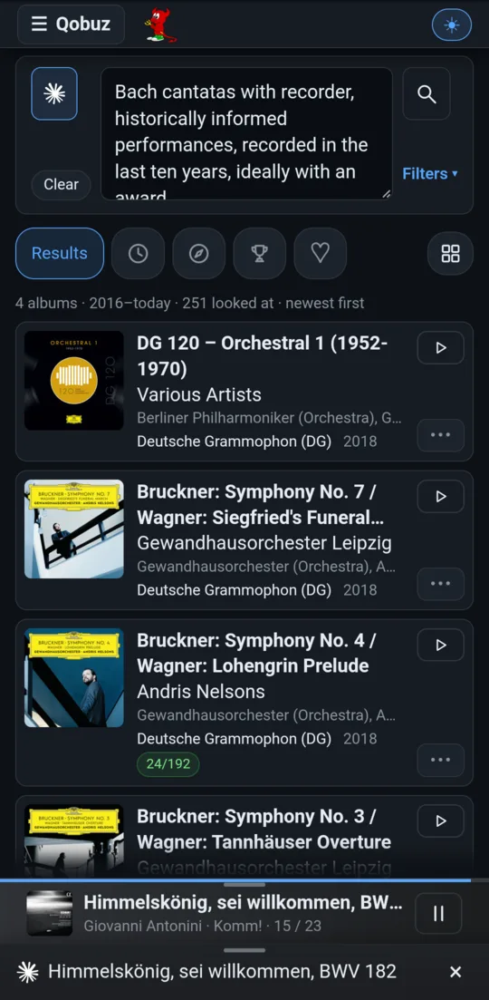

# AI: album search by prompt, and the listening guide

Two AI features. Both research on the web, cite their sources, and are clear
about what they couldn't confirm. Neither listens to the music: what they say
about sound comes from reviews.

[← Back to the README](../../README.md)

## Ask AI: albums from reviews

  
  

Turn on **AI** (the ✳ button beside the Qobuz search box) and describe what
you want in plain words, for example *"three Beethoven Symphony No. 5
recordings, prioritizing sound engineering"* or *"Bach cantatas with recorder,
historically informed, recorded in the last ten years, ideally with an
award"*. Then the AI:

1. **researches** reviews on the web (at most four searches);
2. **plans** up to four Qobuz searches from what it found;
3. **selects** albums only from what those searches returned.

The box then checks every chosen album again (still streamable, still
passing your Hi-Res filter) and shows ordinary playable cards in the AI's
order. Each card has the reason it was chosen and links to the reviews behind
it; a pick without a supporting link is flagged. When nothing meets every
criterion, it says so, as in the screenshot, and explains which compromise
each pick makes.

The label, release-date, Awarded and Hi-Res filters still apply. Changing a
filter **never** starts another AI request by itself: press the magnifier
again. **AI prompt and replies**, under the results, shows each stage: the
exact prompt, the reply, the web searches made and the tokens used.

## The listening guide

**Research music** on Now (or ✳ in the full-screen player) opens a guide to
the album that is playing:

- **Overview**: the release and its works; the composers (or, for pop, rock and jazz, the artist or band), each with a biography that places them in their age; and the principal performers, when their background is verified.
- **One tab per composition**: when, where and why it was written, the composer's life at the time, its premiere and reception, and what to listen for.
- **A note for every track** or movement.

**It follows the music, by itself.** While the guide is open, minimized or
not, it keeps up with playback. When a new album starts, it researches that
album automatically. As tracks change, it moves to the tab of the work
playing. Swipe it down to a strip at the bottom of the screen and it keeps
following there; swipe up to reopen it. **Close** stops it and cancels any
research still running.

Swipe sideways to step through the tabs. For classical albums, Qobuz's own
work metadata decides which movements belong together. Jazz and live albums
get a tab per song; concept albums get one tab for the whole album.

## Providers and costs

**Config → AI settings** chooses the provider:

| Provider | Cost |
|---|---|
| **Claude account**: Claude Code signed in on the box (the default) | Uses your Claude plan's limits; no extra billing |
| **Claude API** with an API key | Billed per use |
| **OpenAI API** with an API key | Billed per use |

API keys stay on the box (mode 0600) and are never sent back to the browser.
The prompts can be customized.

More: [Ask AI](../pdf/open-media-drc-manual.md#ask-ai-recommendations-from-reviews-secask-ai),
[the listening guide](../pdf/open-media-drc-manual.md#the-listening-guide-seclistening-guide) and
[AI settings](../pdf/open-media-drc-manual.md#ai-settings-secai-settings) in the manual.
