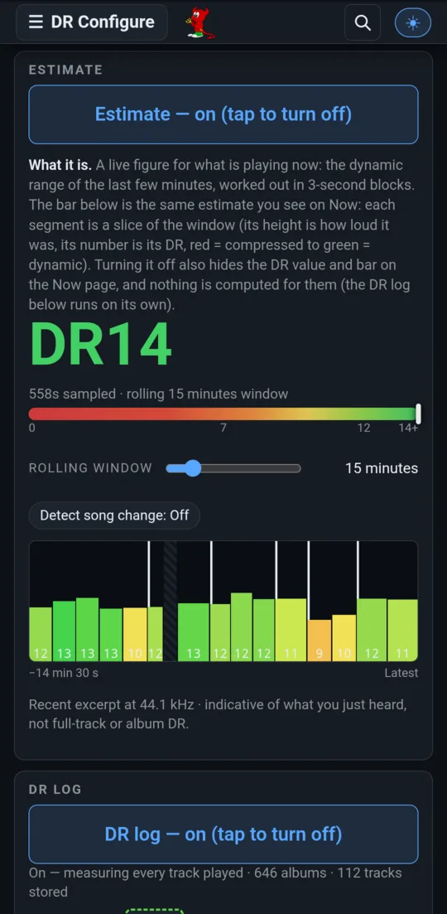
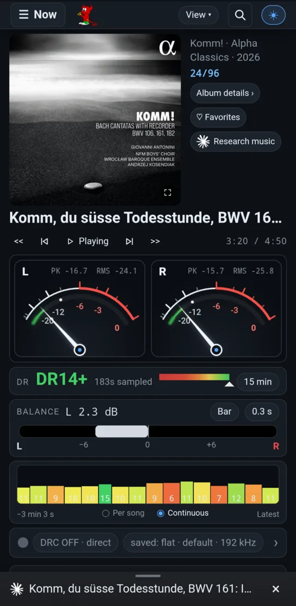
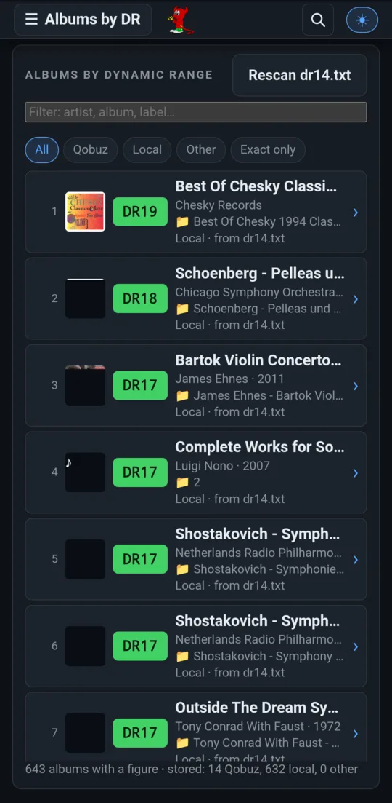
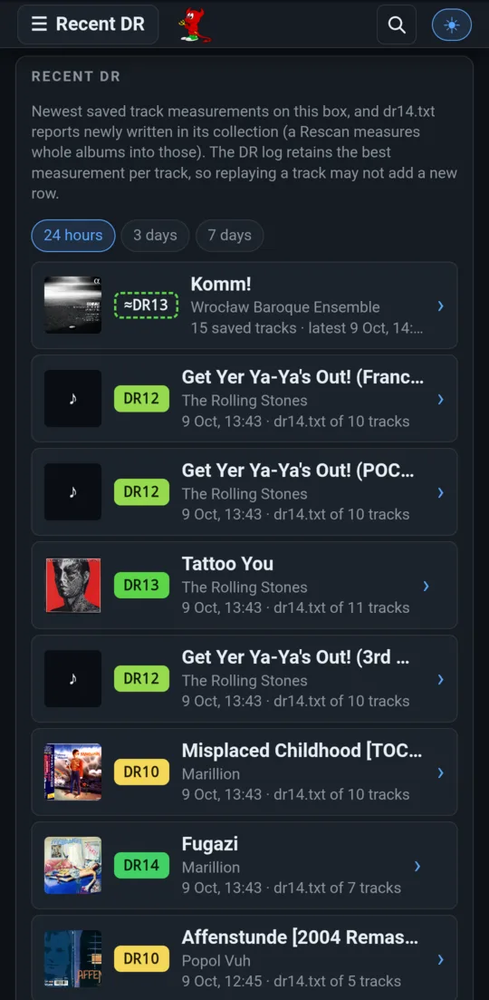
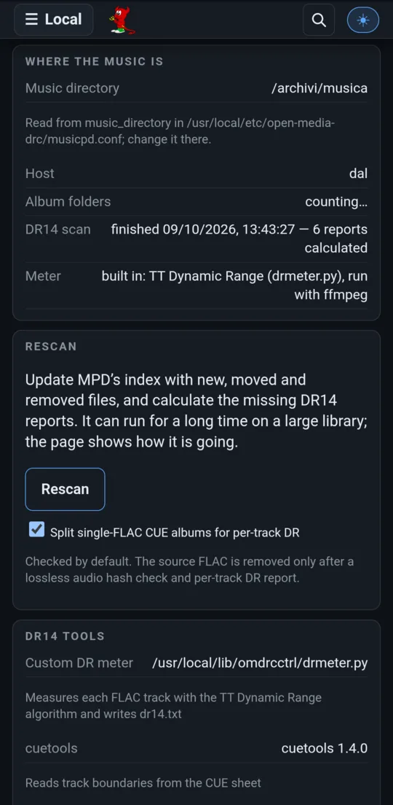

# Dynamic range: live and offline

A record exists in several masters, and they are not equally loud. Alice In
Chains' *Unplugged* measures DR 8 on CD, while vinyl rips of it measure
DR 12–13. The Rolling Stones' *Get Yer Ya-Ya's Out!* is DR 11 on the 2002 CD
and DR 9 as the 2014 download. A streaming service serves one of those masters,
and nothing on the stream says which. open-media-drc measures what you
actually hear, while you hear it and afterwards, and remembers it.

DR here is the **TT Dynamic Range** figure, the same algorithm the
[dr.loudness-war.info](https://dr.loudness-war.info) database uses: the higher the number, the less compressed the master.

[← Back to the README](../../README.md)

## Live: the rolling estimate

  
  

The **live estimate** answers *how dynamic is what I'm hearing right now?* It
needs no download and no disk. It reads MPD's output, works in 3-second
blocks, and gives the DR of a rolling window (1 to 90 minutes) back to the
last silence. The coloured bar is the window's history: each block's height
and colour show how compressed that slice was, with its value printed on it.
Turn on *Detect song change* to restart the window at each track. The figure
also appears on [Now playing](now-playing.md#dynamic-range-live).

## Remembered: the DR log

The **DR log** switch keeps a meter running on the box whether or not any
screen is open, and stores **every track's DR** as it is played:

- A track heard whole (from its start, never sought, to its end) gives an exact value; a partial listen is kept as a partial measurement.
- **The album figure** is the reference's: the mean of the tracks' values. It is **exact** once every track has been heard whole, over any number of sessions. Before that it is an **estimate**, shown as `~DR9` with a dashed outline.
- Every figure appears **in search results**, so you can see which master a Qobuz album is before you play it.

  
  

**Albums by DR** ranks every album with a figure, most dynamic first,
filtered by source (Qobuz, Local, Other), *Exact only* and free text. Tap an
album to see its tracks; a Qobuz album plays from there. **Recent DR** lists
what was measured lately on this box.

## Offline: the DR14 scan of your collection

**Rescan** on the Local page updates MPD's index and then runs the **DR14
scan**. It writes a `dr14.txt` report, in the usual format, for every album
folder that lacks one. Single-file FLAC + CUE albums are split for per-track
figures. Folders appear with their figure within seconds of being measured,
not when the scan ends. A copied-in report that disagrees with an earlier
measurement isn't trusted: the folder is measured again.

## The stream, measured whole

- **Measure DR** fetches the playing record's tracks once more and measures each one, deleting it before fetching the next. It shows progress, the album value as it builds, and a badge per track.
- **DR versions** lists every version of the playing record in the community database, most dynamic first.
- **Which one is playing?** scores each listed version against the track on the wire: running order, track length, stream format, disc, label and year. A medium the stream can't have come from (a vinyl rip, or a CD for a hi-res stream) is ruled out. It names the most likely master.

## Shared between boxes

Boxes that can't reach each other (home and office) share their DR logs
through a private git repository. Each box commits only its own file and
imports the others', so nothing is ever overwritten, and an album's figure
can combine tracks heard on both. A drive that moves between boxes carries a
marker, so its albums are recognized on either box and their DR adds up.

More: [Dynamic range](../pdf/open-media-drc-manual.md#dynamic-range-which-master-and-what-it-measures-secdynamic-range),
[the live estimate](../pdf/open-media-drc-manual.md#the-live-dr-estimate-seclive-dr) and
[the DR log](../pdf/open-media-drc-manual.md#the-dr-log-album-dr-remembered-across-listening-secdr-log)
in the manual.
