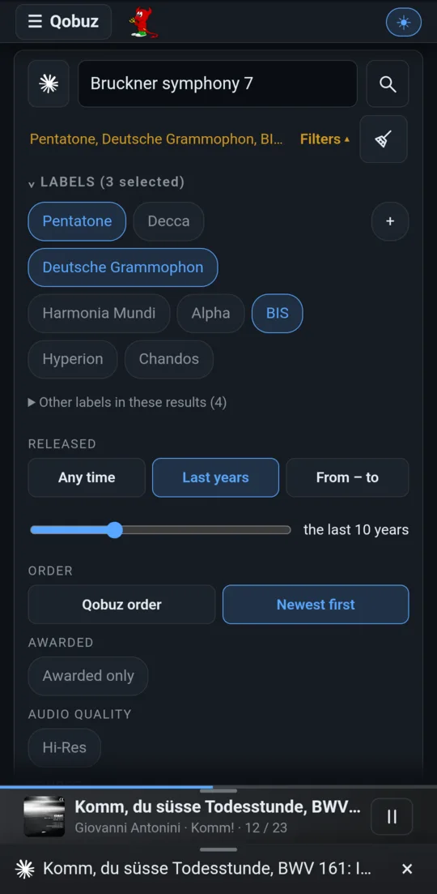
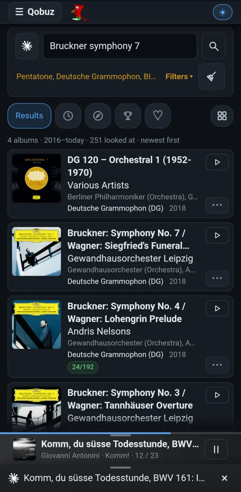
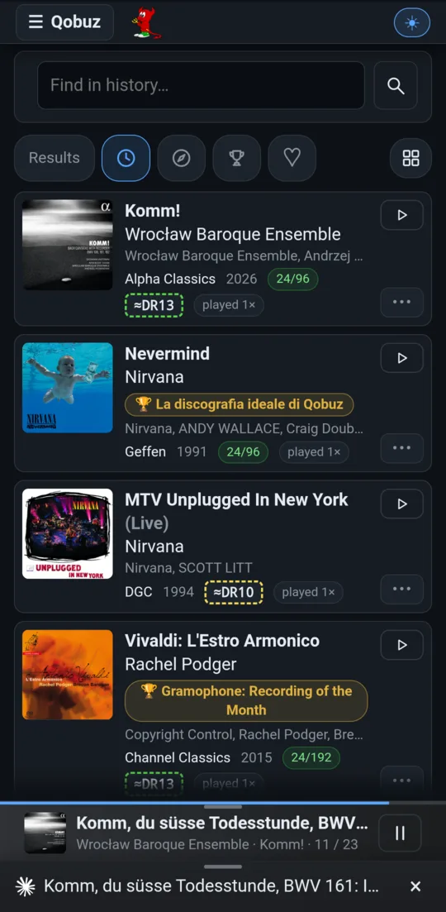
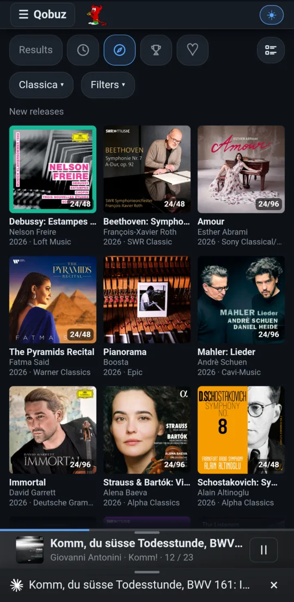
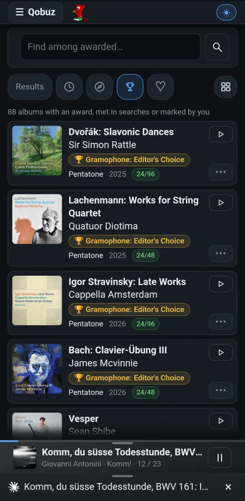
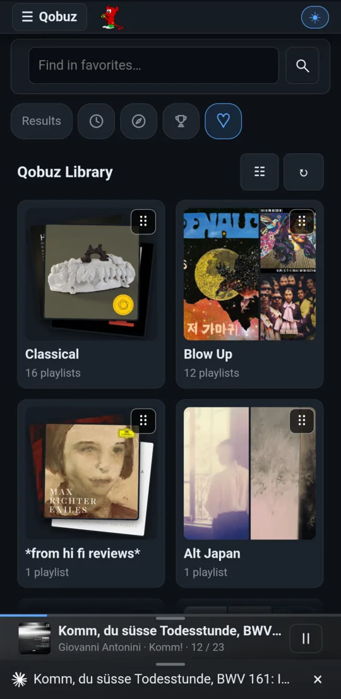
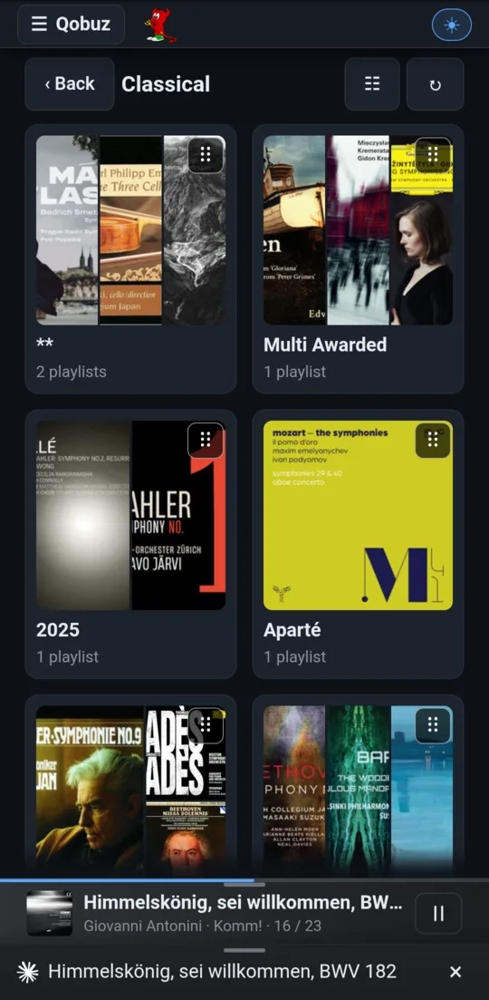
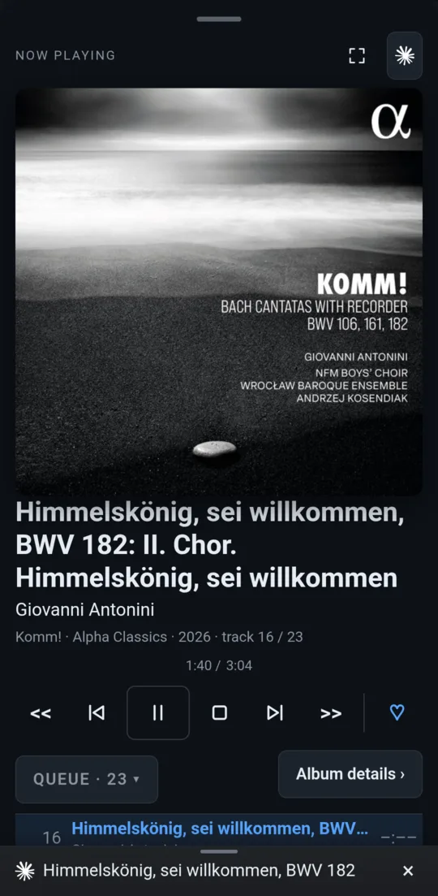

# Qobuz

Qobuz's own apps can't filter a search by **label** or **release date**, the
first two questions a classical listener asks. This page can. It also adds
the views Qobuz lacks: a history of what you played, Discover that reads a
whole label's catalogue, every awarded album you have met, and your
favourites in **nested folders**.

What you pick plays through **upmpdcli**, whose Qobuz plugin streams it from
the box itself, never through the phone. The phone only drives. The page uses
upmpdcli's own Qobuz sign-in and needs no account of its own.

[← Back to the README](../../README.md)

## Search with filters

  
  

Type a composer, a work or a performer, then narrow the search:

| Filter | What it does |
|---|---|
| **Labels** | Your favourite labels as chips; tick several at once. A label is matched as whole words, so *Decca* finds *Decca Music Group Ltd.* and *Decca Classics*. Any label met in the results can be ticked too, and **+** adds one. Typing an artist offers the labels they record for. |
| **Released** | Any time, the last N years (a slider), or a span of calendar years (drag a year spinner, or tap it for a picker). |
| **Order** | Qobuz's own order, or **newest first**. |
| **Awarded** | Only albums with an award or your rating. |
| **Audio quality** | **Hi-Res** leaves out 16-bit/44.1 kHz releases. |
| **Source** | **Local** searches only your own collection. |

A filtered search reads much deeper than Qobuz shows: 250 albums per query,
doubling to 1000 while few match. It also asks Qobuz once per ticked label, so
that label's albums are reached sooner. The result line says how many albums
were looked at. Once results arrive, the filters fold into a single summary
line.

**Each result** shows the cover, title, artist, performers, label, year, the
resolution, its DR when known, and how often you played it. ▶ replaces the
queue and plays; **+** appends to it. A tap opens the track list, where each
track plays on its own.

**Completions.** The field completes from about 2,600 composers, forms,
named works, instruments, conductors, soloists and ensembles, and learns from
what you play after a search. Accents and case don't matter.

**Lowering.** **−** sends an album to the end of every result list, folded
away. The bar that follows can lower its **whole label or artist** instead,
including a conductor or any performer. The **Lowered list** brings them
back.

**Your local collection** is searched at the same time: matching local albums
appear among the Qobuz results, marked ⌂, with their DR, and play through
the same queue.

## The views

The chips under the box choose the list shown under it. **The search box
searches the selected view**, each view with its own text.

| | | | |
|---|---|---|---|
|  |  |  |  |
| **History**: albums played from here, newest first; the box filters them as you type | **Discover**: Qobuz's new releases by genre, as a list or a cover grid | **Awarded**: every album met with an award, plus the ones you marked; the box also matches award names (*gramophone*) | **Favourites**: your Qobuz library in folders; the box searches every folder |

- **Results** is the catalogue search above, with its filters.
- **Discover's Filters** pick labels, awarded only and Hi-Res. With a label ticked, Discover reads **that label's own catalogue**, newest first. Qobuz's new-releases list ends a few hundred albums back and holds only a handful of any one label. Discover has no search box: for words, search in Results with *Newest first*.
- **The grid button** switches every list between rows and cover tiles.

## Favourites: folders Qobuz doesn't have

  
  

Qobuz keeps favourites as one flat list. Here they live in **nested folders**
(Classical → Gramophone → Awards → 2024), shown as tiles with a collage of
their covers, or as an expandable tree.

- **A folder is a Qobuz playlist** whose name is the folder path, so nothing is locked in: the same playlists remain in every Qobuz app.
- **♡** on Now or in the full player files the playing album into a folder, or into a new one.
- **Hold** a folder tile to rename, move or delete it. **Drag** the handle to reorder tiles. The order is kept on the box and shared by every phone and screen.
- Hearted albums that aren't in any folder are under **Qobuz**.

## Awarded and your ratings

Qobuz lists awards for some albums (Gramophone Editor's Choice, Diapason d'Or…)
but few of the magazines' choices. Every award is remembered as soon as the
app meets the album: in a search's first results, in a list on screen, or in
Album details. In **Album details → Add award or rate** you can mark an album
yourself (Gramophone, Diapason, BBC Music Magazine, Stereophile, Hi-Fi News or
any name) and rate the recording 1 to 3. Your marks show wherever the album
appears, count for the *Awarded* filters, and are found by the Awarded view's
search.

## The player

A strip at the bottom shows the track and play/pause, tinted with the
cover's colours. It opens into a full-screen player: the cover, the track,
work, album, label and year, the transport, ♡, and the queue. Tap a queue
entry to play from it. Swipe it left to remove it, or hold it to remove the
track or its whole album.

More: [Qobuz album search](../pdf/open-media-drc-manual.md#qobuz-album-search-secqobuz-search)
in the manual. The AI features are in [AI](ai.md).
