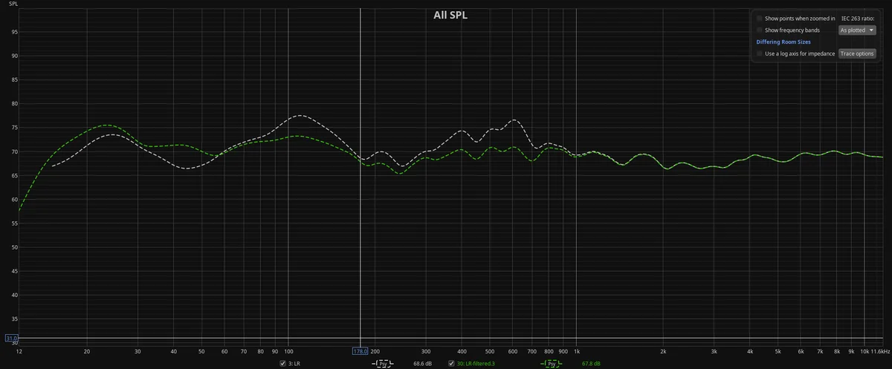
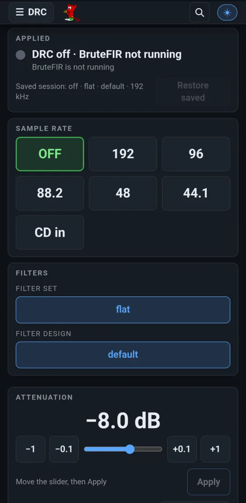
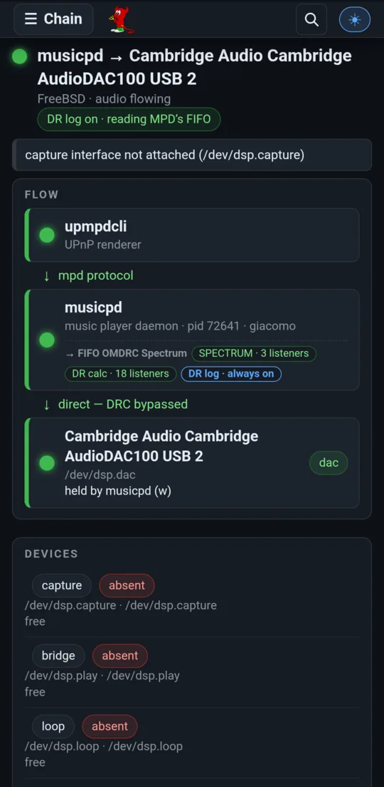
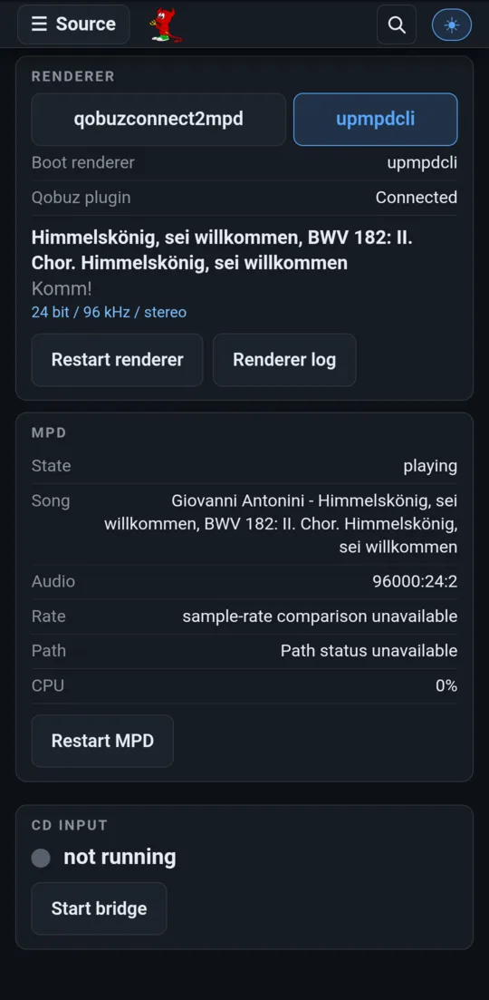
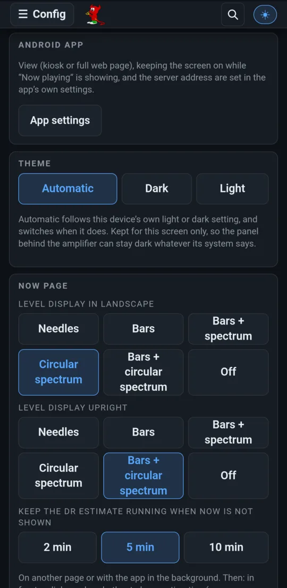
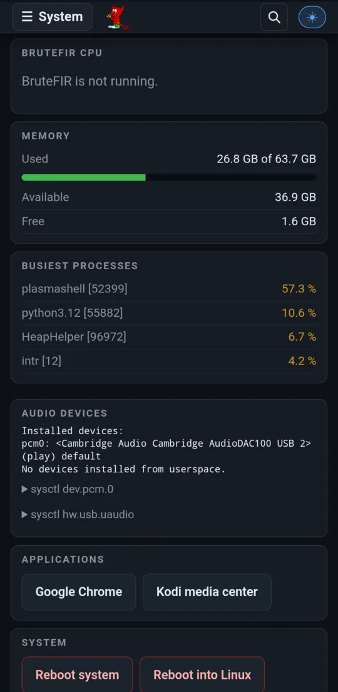

# Room correction and the audio chain

Your room is part of your hi-fi. Its modes swell some bass notes and swallow
others, and no amplifier or cable fixes that. open-media-drc measures the room
once, in Room EQ Wizard, and then corrects every note in real time with
**BruteFIR**: one FIR filter per channel and per sample rate, convolved in
64-bit floating point. Switch correction off and the chain collapses to a
direct path to the DAC, which the project's tools verify as **bit-perfect**.

[← Back to the README](../../README.md)

*A measured room: uncorrected (white) and corrected (green). The 100 Hz and
400–600 Hz peaks are tamed and the response above 1 kHz is left alone.*

## The DRC page

- **Applied**: whether correction is running, and the saved session it will come back to.
- **Sample rate**: **OFF** (direct, bit-perfect), a native rate (192, 96, 88.2, 48, 44.1 kHz), or **CD in**. A native rate keeps the source untouched up to the filter. For mixed-rate playlists, `omdrc resamp` has MPD resample everything to 192 kHz with soxr.
- **Filters**: the installed filter set and design.
- **Attenuation**: the headroom in front of the filters. The default is computed from the filters' worst-case gain plus a safety margin. In float64 attenuation is lossless; its only job is to keep the output from clipping.
- **BruteFIR health**: the filters' peak level and BruteFIR's real-time index.

## Only two resting states

The chain is either **DRC fully up** (BruteFIR processing) or **direct
output**. Nothing in between survives. A start that fails rolls back to
direct output. If the DAC is unplugged, the chain tears down and keeps your
intent; when the DAC returns, the chain comes back as it was. Boot, hotplug
and every button reconcile the same rule. The shell equivalent is `drc.sh`
(`omdrc 192000`, `omdrc resamp`, `omdrc off`).

## Filters you can trust

A converted filter is a blob of float64 coefficients, indistinguishable from
any other blob of the same length. So every filter is deployed as a
**provenance bundle**: a chain of content hashes from the original REW exports
to the bytes BruteFIR has actually loaded. Every link that can't be checked is
refused. The web panel shows stored room measurements only next to the
filter they describe. Installing a new design needs no shell: upload the REW
export pair on the **Configuration** page and it is audited, built and
published.

## The audio chain

  
  

- **Chain** draws the path from renderer to DAC as it is now: who plays, through which output, into which device, and who holds each device. It also shows when the DRC is bypassed.
- **Source** switches the renderer (upmpdcli for UPnP/OpenHome and Qobuz, or qobuzconnect2mpd for Qobuz Connect), restarts it, shows its log and MPD's state, and starts the **CD input**.
- **CD input** captures a CD transport's S/PDIF through a USB interface into the loopback BruteFIR reads. A disc gets exactly the same correction as a stream, and the samples are never resampled.
- **Config** (and the desktop panel's Configuration page) chooses the DAC and the capture interface by USB identity, installs filter designs, and sets each screen's own preferences.

  
  

## Bit-perfect, proven

Bit-perfection is proved, not assumed. A tap records the USB stream at the
last point the host controls, the data handed to the USB controller, and
compares it byte for byte with the reference. The panel's **Bit-perfect
check** page runs that tap through five paths:

- plain `aplay`, as the control;
- MPD playing a local file;
- MPD streaming over HTTP;
- the whole upmpdcli path;
- live, while you play a track from the Qobuz app through Qobuz Connect.

It shows the compared bytes, and reports a renderer that quietly changed MPD's
volume or replaygain.
The tools also cover native-rate DRC, glitch detection, and the comparison
between Linux and FreeBSD.

More in the manual: [usage of drc.sh](../pdf/open-media-drc-manual.md#usage-drcsh-filters-and-configuration-secusage),
[filter provenance](../pdf/open-media-drc-manual.md#filter-provenance-and-verification-secprovenance),
[the Configuration page](../pdf/open-media-drc-manual.md#configuration-page-----filter-installs-and-audio-hardware-roles-secconfiguration-page),
[CD input](../pdf/open-media-drc-manual.md#cd-input-spdif-capture-into-the-drc-chain-seccdin) and
[bit-perfect verification](../pdf/open-media-drc-manual.md#bit-perfect-verification-secbitperfect).
